# Avaliação visual do Xadrez CGI — 26/09/2026

Escopo: menu, mesa/tabuleiro, inspeção de personagens no PC e ambiente/interface
no caminho VR simulado. Capturas novas da Main, usando os scripts existentes.
Nenhum script, material, prefab ou cena do jogo foi alterado nesta avaliação.

## Direção recomendada

Um laboratório Feevale reconhecível, com um jogo de miniaturas bem acabado
sobre uma mesa realista. Preservar a identidade dos personagens, as roupas
brancas/pretas e a marca nas costas. Dar ao tabuleiro mais acabamento e à
iluminação mais profundidade, mantendo leitura clara das peças.

## 1. Abrir o menu — identidade forte; integração espacial a melhorar

O verde, amarelo, tipografia e personagens criam uma identidade clara. O
menu tem atmosfera mais elaborada que a sala durante a partida. No VR, o
menu ocupa uma grande superfície retangular diante da sala, reproduzindo a
composição do desktop. Os textos secundários parecem pequenos nesta captura.

Proposta: usar o próprio laboratório como fundo do menu, manter só as escolhas
necessárias em um painel mais simples e testar tamanho/distância de textos e
botões no headset. Não trocar a identidade Feevale já aprovada.

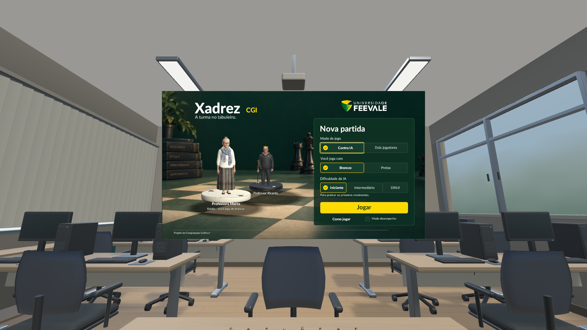

## 2. Olhar para a mesa e iniciar a partida — maior oportunidade visual

A sala está reconhecível e os dois times se separam pelas roupas e bases. O
tabuleiro, porém, tem casas de cor quase uniforme, borda fina e acabamento
mais simples que as figuras. Mesa e piso têm tons próximos; a madeira é
visível, mas repetição e direção dos veios dominam grandes superfícies.

Propostas prioritárias:

- Tabuleiro com moldura mais encorpada, quinas suavizadas, duas madeiras
  distintas e verniz acetinado discreto. Letras A–H e números 1–8 integrados
  à borda; confirmar orientação correta para os dois jogadores.
- Mesa com textura em escala natural, variação suave de rugosidade e detalhes
  nas bordas. Manter a área das mãos e das peças livre de decoração.
- Luz lateral coerente com as janelas, preenchimento suave do teto e sombras
  de contato sob bases, tabuleiro, móveis e rodinhas. Avaliar luz indireta
  pré-calculada e reflexos locais; medir o custo no headset escolhido.
- Símbolos nas bases com contraste e espessura consistentes, legíveis da
  posição sentada. Reforçar identidade pelos símbolos e acessórios existentes.

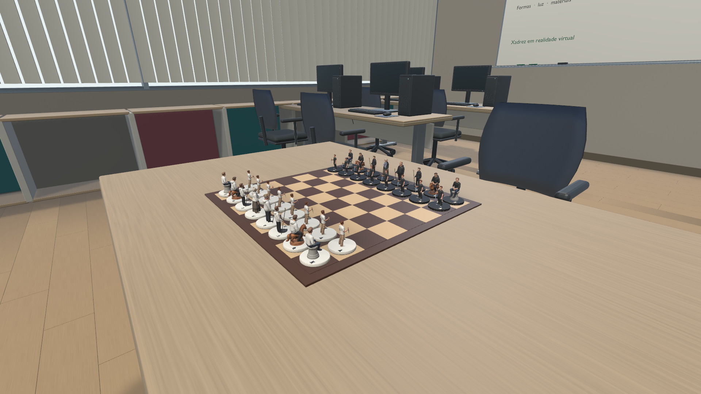

Ao olhar para baixo no caminho VR simulado, a barra de ações aparece distante,
acima e à esquerda, enquanto turno/histórico não aparecem no enquadramento
principal do tabuleiro. Isso é evidência da composição capturada, não uma
medição de alcance ou conforto em headset físico.

Proposta: um painel compacto junto à mesa para turno e ações essenciais;
histórico e detalhes do personagem sob demanda, sem cobrir as casas.

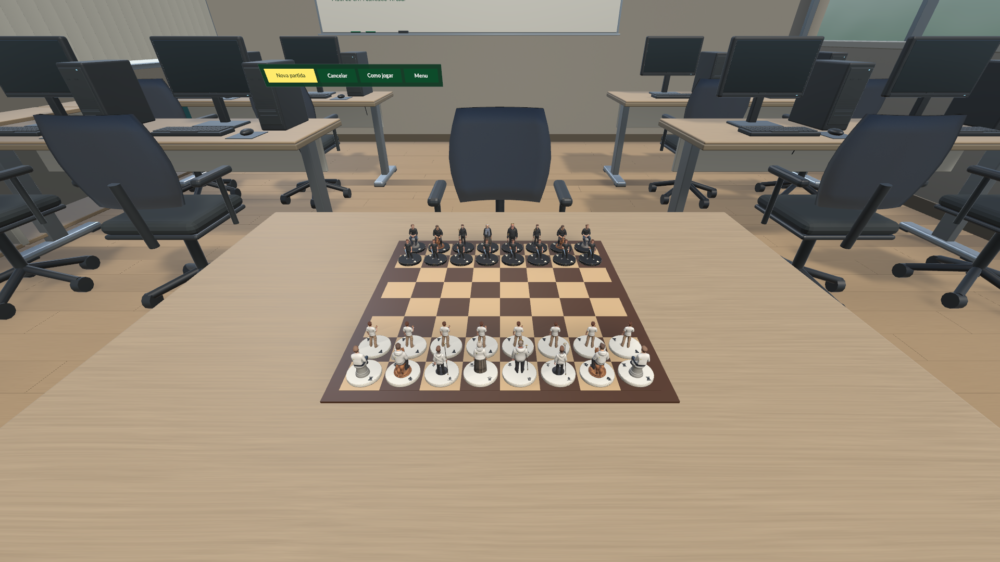

## 3. Selecionar e inspecionar uma peça no PC — controles claros; densidade alta

O zoom de 182% preserva a cabeça e os botões de deslocamento e restauração
estão visíveis. O Ricardo aparece inteiro após restaurar, e o Gustavo mantém
a cabeça dentro da imagem. A ficha e o histórico ocupam uma área grande à
direita e encobrem parte da borda/casas desse lado na câmera capturada.

Propostas:

- Recolher histórico e informações biográficas quando não forem necessários;
  ajustar o enquadramento do tabuleiro para a área livre enquanto a ficha abre.
- Diferenciar peça selecionada, casa de origem, destinos legais, captura e
  último lance por forma/contorno e contraste, além de cor. Os destinos atuais
  são discos verdes; a seleção já usa aumento de escala.
- Polir localmente rostos, cabelos, mãos, punhos, costuras e contato com os
  acessórios. Conferir UV, mapas de superfície e compressão nas regiões com
  perda de detalhe antes de decidir a resolução final de cada textura.
- Aproveitar a animação de deslocamento em arco já existente e estudar um
  acabamento curto para pouso/captura, sem exigir reconstrução de rig nesta etapa.

As imagens não permitem concluir que todas as texturas dos 12 modelos estão
sem defeitos; este é um diagnóstico de apresentação, não uma auditoria completa
de malha, UV ou animação.

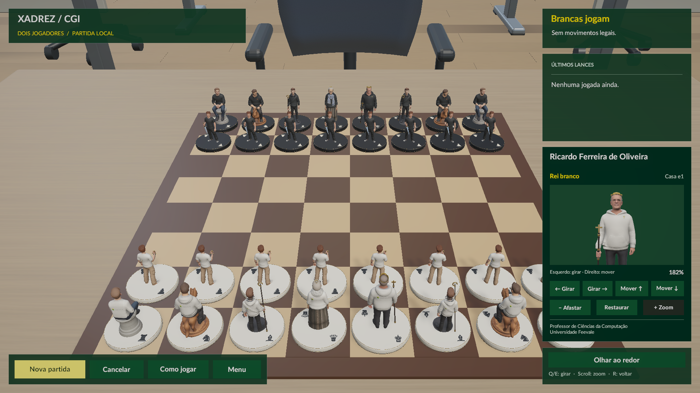

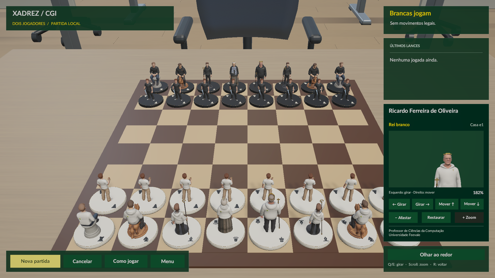

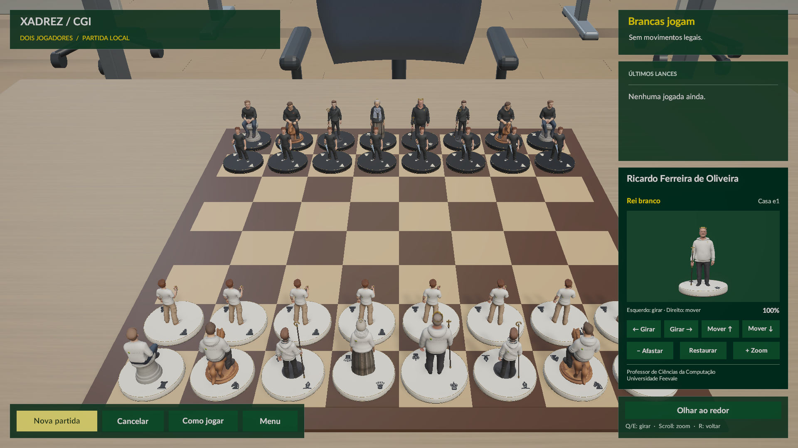

## 4. Observar o laboratório — boa estrutura; falta variação e sinais de uso

Persianas, computadores, quadro, nichos, janelas e mobiliário estabelecem o
laboratório. Os monitores estão todos escuros, cadeiras e máquinas se repetem,
e grandes áreas da parede/teto têm pouca variação. O vidro mostra um gradiente
suave que ainda comunica pouco sobre o exterior. A marca na parede tem pouco
contraste nessa vista.

Propostas:

- Algumas telas ligadas com conteúdo discreto da disciplina; variação leve
  na rotação das cadeiras e no estado de poucos postos.
- Poucos objetos bem escolhidos: caderno e caneta em uma bancada, mochila
  junto a uma cadeira, avisos e identificação da sala. Evitar ocupar a mesa de jogo.
- Acabamento nos encontros de parede/piso, caixilhos, metais e estofados,
  distinguindo a resposta à luz de cada material.
- Vidros com reflexão suave e uma sugestão do exterior. Manter a inspiração
  na sala 102; não afirmar uma réplica fiel sem medidas e referências adicionais.
- Ajustar contraste da marca da parede sem espalhar logos por toda a sala.

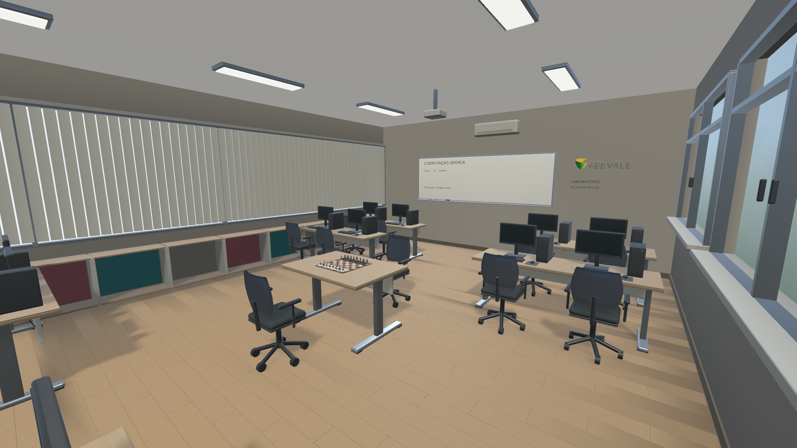

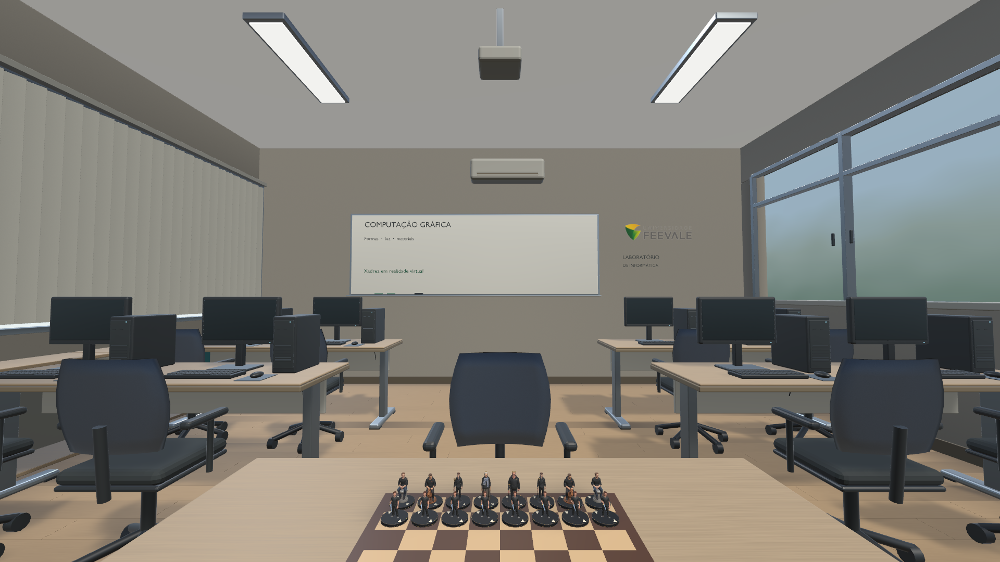

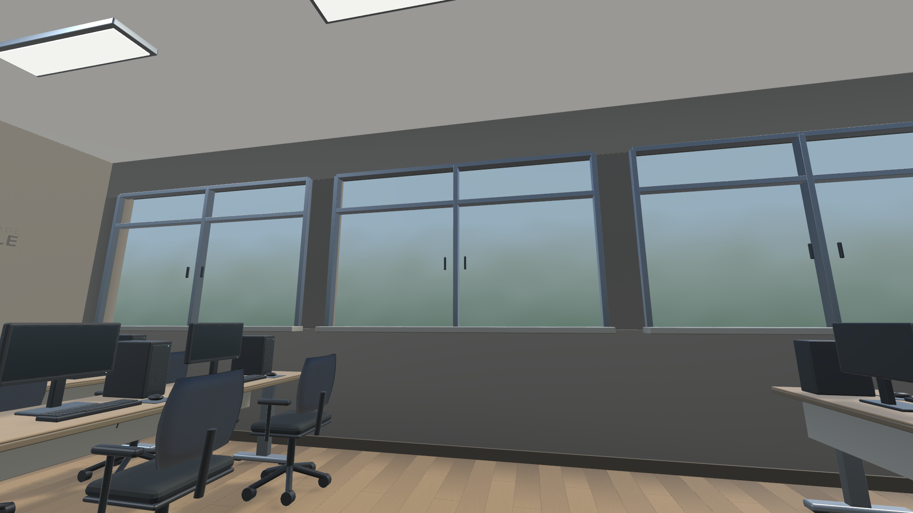

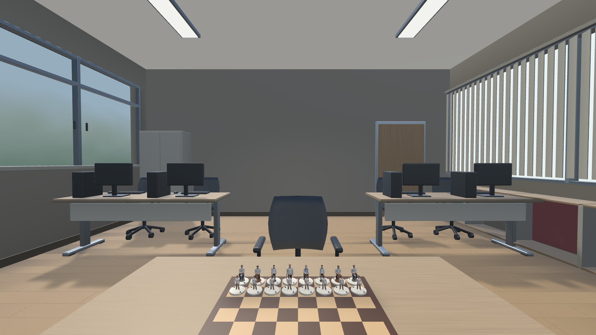

## Ordem de trabalho sugerida

| Prioridade | Frente | Critério de revisão |
| --- | --- | --- |
| Alta | Tabuleiro, mesa e iluminação | Identificar madeira, bordas e contato com a mesa a partir do assento e de perto, sem reflexo que esconda casas. |
| Alta | Interface PC/VR e leitura dos lances | Ver casas e peça selecionada; acessar turno/ações sem procurar a interface pela sala. |
| Média | Bases e acabamento localizado dos personagens | Reconhecer o tipo da peça dos dois lados; conferir tecidos e acessórios em close. |
| Média | Detalhes e materiais da sala | Perceber materiais distintos e sinais de uso sem distrair da partida. |
| Posterior | Coerência do menu e efeitos de movimento | Entrada e partida com a mesma direção visual; transições curtas e confortáveis. |

## Evidência, limites e preservação

- Doze imagens novas em 1920 × 1080 foram abertas e inspecionadas nesta revisão.
- VR: XRSimulatedHMD, câmera monoscópica, sem pós-processamento; nas vistas
  de ambiente o capturador oculta o HUD e controles sem rastreamento. Não usar
  essas vistas sem HUD como prova de que ele não existe.
- PC: Main com HUD convertido para Screen Space Camera para entrar na captura;
  no jogo normal o Canvas é Screen Space Overlay. A conversão pode alterar o
  aspecto das cores do HUD por pós-processamento.
- Não foi feita validação estéreo, de taxa de quadros, interação manual ou
  conforto em headset físico. Não inferir nitidez final do headset pelo PNG.
- Os 188 arquivos protegidos mantiveram seus hashes. As capturas anteriores
  foram preservadas e restauradas; só este relatório, estas imagens e logs
  locais foram acrescentados.
- Graphify estava CURRENT; os comportamentos citados foram confirmados em
  BoardView, ScenePolish, PieceView e GameHud. Nenhuma alteração de jogo aplicada.

## Referências consultadas

A [página oficial da Feevale](https://www.feevale.br/pos-graduacao/stricto-sensu/mestrado--profissional-em-industria-criativa/infraestrutura)
identifica o Laboratório de Redes na sala 102, prédio Verde, Câmpus II. A sala
atual do jogo continua sendo uma adaptação inspirada nesse contexto.

O [guia da Unity 6.3 para iluminação](https://docs.unity3d.com/6000.3/Documentation/Manual/lighting-configuration-workflow.html)
e a [documentação de reflection probes em URP](https://docs.unity3d.com/6000.3/Documentation/Manual/urp/lighting/reflection-probes-introduction.html)
fundamentam os caminhos técnicos a avaliar; não são resultados já implantados.

As [orientações de UI em cenas 3D da Meta](https://developers.meta.com/horizon/design/hands-3d-best-practices/)
recomendam distinguir objetos manipuláveis de controles de painel. O
[guia de layouts](https://developers.meta.com/horizon/design/styles_layouts/)
reforça verificar legibilidade e distância no hardware real. São referências
para a proposta VR, não prova de conformidade do jogo.

## Captura complementar

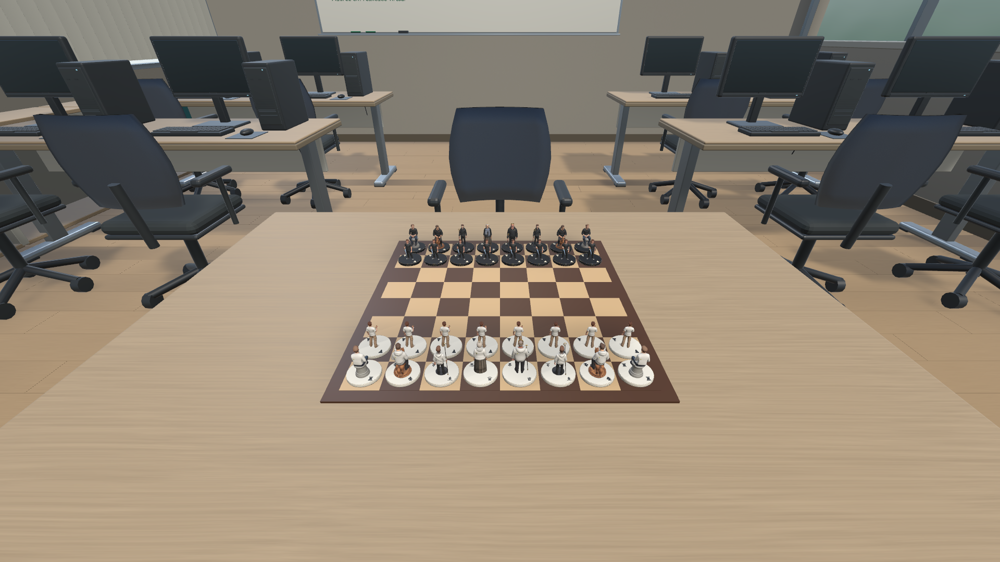
