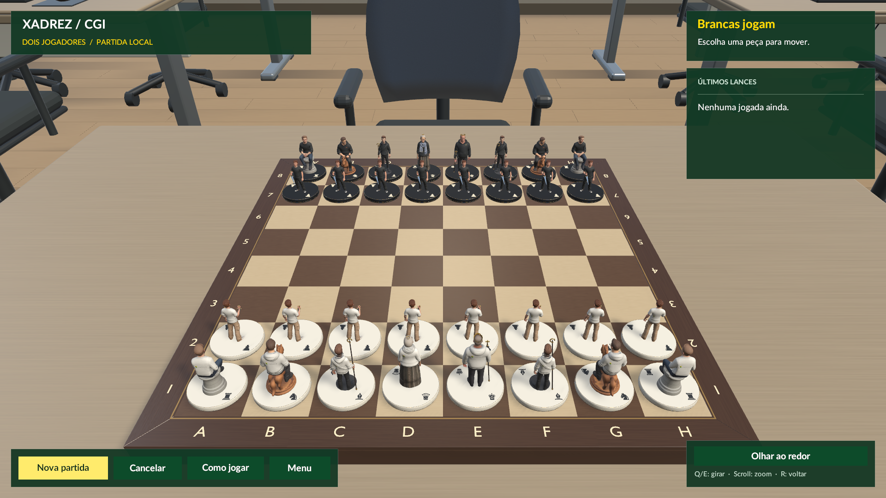
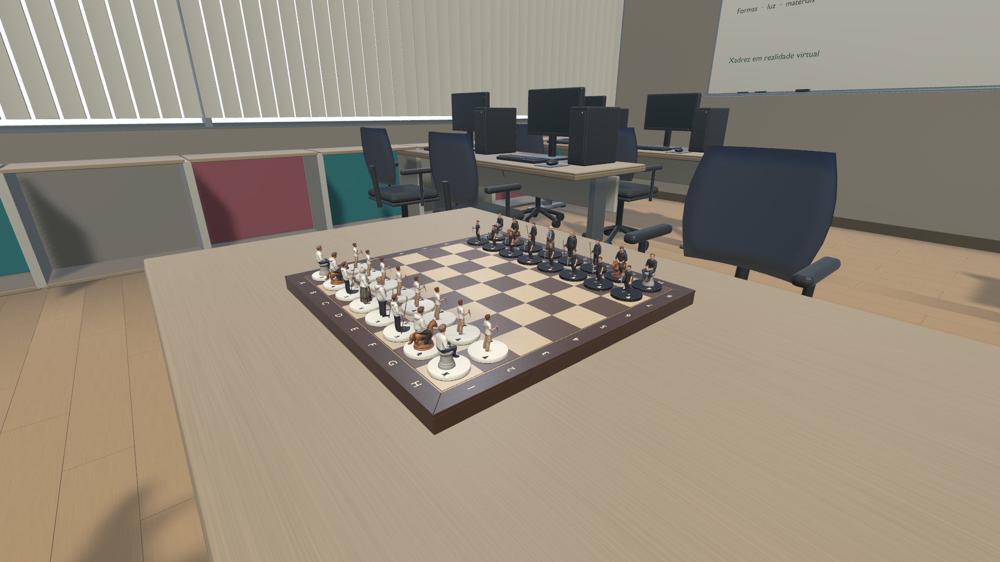

# Entrega visual Feevale

Consolidação de 28/09/2026 na branch `codex/visual-feevale`, sobre a base
`81bea194e6b4a24adfaf3c24b235709660829c8e` da `main`. Essa base já inclui
IA e portabilidade para VR. A entrega mantém as versões do Unity
6000.3.16f1, URP 17.3.0 e os pacotes existentes.

## Escopo entregue

- Seis personagens e 12 variantes de lado, roupas brancas/pretas, logo Feevale
  nas costas, acessórios, bases e símbolos. Modelos originais e GUIDs dos
  prefabs preservados; texturas e modelos de produção em `Assets/Art/Characters`.
- Laboratório inspirado nas referências Feevale, incluindo a sala 102 do
  prédio Verde; computadores, mobiliário, persianas, janelas e materiais.
  É uma adaptação para o jogo, não uma réplica medida.
- Tabuleiro de madeira, moldura, coordenadas, acabamento da mesa, sombras
  e iluminação. Os prefabs do ambiente ficam em `Assets/Resources/Environment`.
- Olhar ao redor no desktop e controles do preview da peça, incluindo
  reposicionamento quando ampliada. A câmera rastreada do VR permanece separada.
- Geradores e fontes Blender, importadores Unity, auditorias, capturas e
  documentação. [Índice completo da arte](../art/character-variants/README.md).

O experimento posterior de HUD compacto, indicadores de destinos/captura,
última jogada e estados da partida foi revertido. Seus prints estão marcados
como históricos. Esta branch não altera regras, IA, promoção nem encerramento
de partida; `ChessGameController.cs` permanece igual à base.

O ensaio local `Assets/AnimationStudies/A003`, anterior a esta frente e
dependente de entradas locais, não faz parte desta entrega. Fotos privadas,
backups, caches, logs completos e builds também não são publicados.

## Abrir e conferir

1. Obter esta branch e abrir a pasta `game` no Unity 6000.3.16f1.
2. Abrir `Assets/Scenes/Main.unity` e entrar em Play, ou usar
   **Chess CGI → Jogar no Editor**.
3. Desmarcar **Modo desempenho** para ver os personagens personalizados.
4. Iniciar uma partida local e conferir os dois lados. Para IA, seguir a
   [preparação do Stockfish](ai-desktop.md), que já existia na base.

Os GLBs, texturas, materiais, prefabs e `.meta` necessários estão no Git.
Não é necessário ter Blender nem executar os geradores para jogar. As fontes
editáveis foram produzidas no Blender 5.2.1.

| Contexto | Controles |
| --- | --- |
| Tabuleiro no PC | Clique na peça e no destino; Q/E para órbita; scroll para distância |
| Sala no PC | Botão **Olhar ao redor** e arraste direito; R, Esc ou botão de retorno para voltar |
| Preview da peça | Arraste esquerdo para girar; scroll ou +/− para zoom; arraste direito/do meio para reposicionar; botões Mover ↑/↓ e Restaurar |
| VR | Pose do headset e interação de mãos/controles já existentes na base |

## Verificação desta consolidação

Executado em 28/09/2026, com o Editor fechado, pelo fluxo do repositório:

```sh
bash tools/test_unity.sh
```

- 36 testes EditMode aprovados.
- 62 testes PlayMode aprovados, sem falhas ou ignorados.
- A verificação cobre as regras existentes e os testes de personagens,
  ambiente, câmera desktop, preview, tabuleiro e integração simulada de VR.
- Resultado portátil em [art/verification-20260928.json](../art/verification-20260928.json).
  XML e logs completos ficam localmente em `TestResults/`.

As [capturas do acabamento aprovado](../art/character-variants/tabletop-polish-20260926/README.md)
foram feitas em 26/09. Não são novas capturas da consolidação. Não houve
build de player, teste com headset físico nem medição de desempenho em VR.

## Integração posterior com a equipe

As branches abaixo foram observadas no remoto em 28/09; nenhuma foi
incorporada nesta entrega. Arquivos em comum indicam pontos de revisão,
não conflitos de merge já confirmados.

| Frente remota | Atenção na integração |
| --- | --- |
| `feat/game-over-screen` | `GameHud.cs`, `GameHud.Match.cs` e testes do menu: preservar a tela de fim de partida do colega e nossos controles do preview |
| `feat/board-feedback` e `feat/captured-pieces` | `BoardView`, `PieceFactory`, `ScenePolish` e HUD: combinar feedback/capturas com variantes, bases e materiais |
| `feat/adjustable-table` | `BoardView`, `ScenePolish` e HUD: conferir alinhamento da sala, reflexo e contato entre mesa e moldura após ajuste de altura |
| `feat/vr-ray-and-turn-indicator` | HUD, `BoardView` e `ScenePolish`: conferir apontamento e indicador de turno com o ambiente novo |

Os changelogs, glossários e testes de apresentação também têm alterações
nas duas frentes. Antes do merge, confirmar com a equipe a branch responsável
por promoção de peças; não deduzir seu responsável pelos nomes acima.

Na integração, manter os GUIDs e os pares asset/`.meta`, combinar os trechos
compartilhados e executar novamente os testes. Conferir ainda uma partida
PC, os controles de preview/sala e o fluxo VR no dispositivo disponível.
Não resolver conflitos escolhendo uma versão inteira dos arquivos compartilhados.

## Referências visuais




